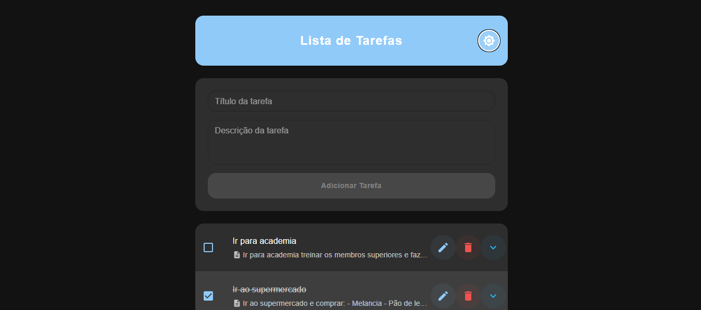

<h1 align="center">
    <a href="https://laravelcollective.com/tools/banner">
        
    </a>
</h1>

# 📝 Lista de Tarefas (Todo List)

<p align="center">Uma aplicação web moderna de lista de tarefas desenvolvida com React no frontend e Laravel no backend. </p>

<h2 align="center">
  
  
  
</h2>

## 📌 Índice
<p align="center">         
  <a href="#tecnologias">Tecnologias </a> &nbsp; &nbsp; &nbsp; | &nbsp; &nbsp; &nbsp;        
  <a href="#instalação"> Instalação e Uso </a> &nbsp; &nbsp; &nbsp;
</p>  

## Tecnologias                                
### Frontend


### Backend


## 📋 Pré-requisitos

Antes de começar, você precisará ter instalado em sua máquina:
- [Node.js](https://nodejs.org/) (v18 ou superior)
- [PHP](https://php.net) (v8.1 ou superior)
- [Composer](https://getcomposer.org/)

## 🔧 Instalação e Configuração

### Backend (Laravel)

1. Navegue até a pasta do backend:
```bash
cd backend
```

2. Instale as dependências do PHP:
```bash
composer install
```

3. Copie o arquivo de ambiente:
```bash
cp .env.example .env
```

4. Configure o arquivo .env com suas credenciais do banco de dados

5. Gere a chave da aplicação:
```bash
php artisan key:generate
```

6. Execute as migrações do banco de dados:
```bash
php artisan migrate
```

7. Inicie o servidor:
```bash
php artisan serve
```

O backend estará rodando em `http://localhost:8000`

### Frontend (React)

1. Em outro terminal, navegue até a pasta do frontend:
```bash
cd frontend
```

2. Instale as dependências:
```bash
npm install
```

3. Inicie o servidor de desenvolvimento:
```bash
npm run dev
```

O frontend estará disponível em `http://localhost:5173`

-------------          

- [Voltar ao Início](#index)
