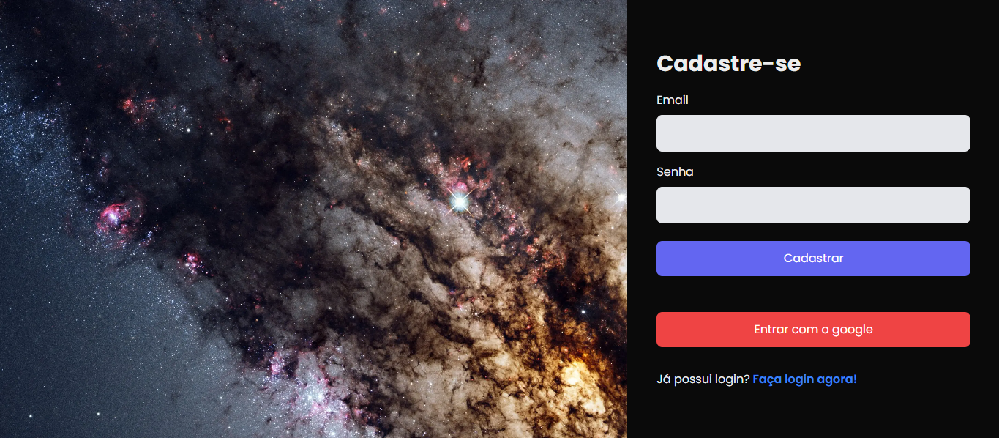

<h1 align="center">
    <a href="https://laravelcollective.com/tools/banner">
        
    </a>
</h1>

# 📝 Todo List App

<p align="center"> Sistema Web de Todo List criado para testar meus conhecimentos em Next.js. </p>

<h2 align="center">
  
  
  
</h2>

## 📌 Índice
<p align="center">         
  <a href="#descrição"> Descrição </a> &nbsp; &nbsp; &nbsp; | &nbsp; &nbsp; &nbsp;  
  <a href="#tecnologias">Tecnologias </a> &nbsp; &nbsp; &nbsp; | &nbsp; &nbsp; &nbsp;        
  <a href="#instalação"> Instalação e Uso </a> &nbsp; &nbsp; &nbsp;
</p>          

## Descrição          

Status: Em desenvolvimento

Todo List App é uma aplicação de gerenciamento de tarefas que permitem aos usuários organizar e acompanhar suas atividades diárias de forma eficiente. Eles ajudam a criar listas de tarefas, definir prazos, adicionar lembretes e priorizar o que precisa ser feito. Esses apps são populares por aumentar a produtividade, proporcionando uma visão clara das tarefas pendentes e concluídas. 

## Tecnologias                                


## ⚙ Instalação   

### Clonagem

Primeiro, clone o repositório para seu ambiente:

```bash
> git clone https://github.com/Gabrielrc11/todo_list.git
```

Depois, entre no repositório clonado e no diretório correspondente ao que quer testar (web, server).
Logo após, insira os seguintes comandos no seu terminal respectivamente para rodar a aplicação:

```bash
npm run dev
# or
yarn dev
# or
pnpm dev
# or
bun dev
```

Abra [http://localhost:3000](http://localhost:3000) no seu navegador para ver a aplicação.

-------------          

- [Voltar ao Início](#index)